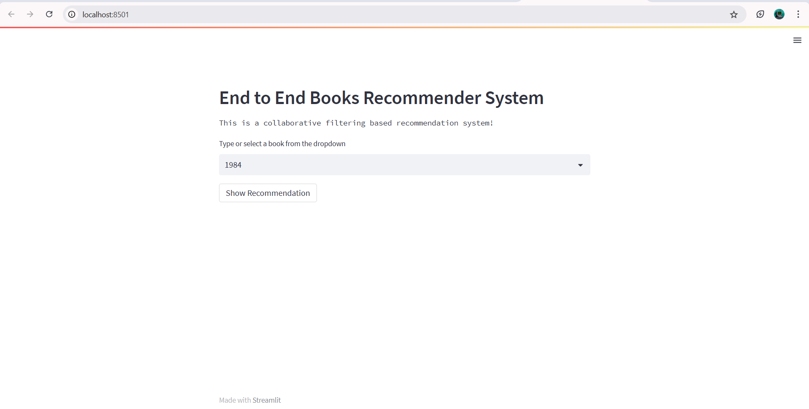
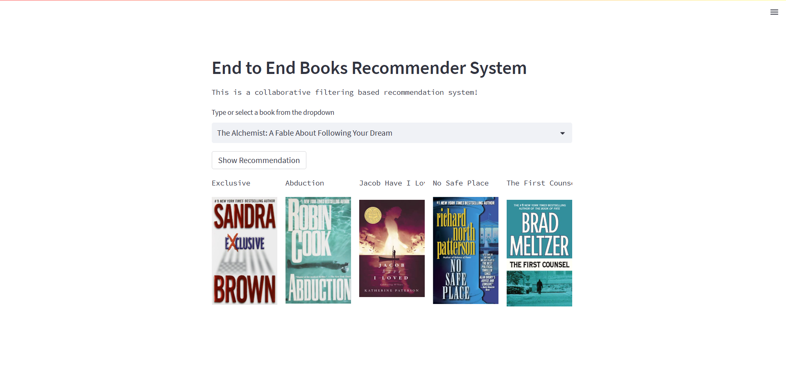

# End_to_End_Book_Recommender_System  
**Collaborative Filtering based Book Recommendation**

📌 **Project Overview**  
This project builds a complete Book Recommender System using Collaborative Filtering techniques. It predicts user preferences by analyzing user-book interaction data to recommend books similar users have liked.

🚀 **Features**  
- Modular pipeline with stages: data ingestion, validation, transformation, and model training  
- Collaborative Filtering algorithms (User-Based and Item-Based) for recommendations  
- Config-driven design for easy tuning  
- Robust logging and exception handling  
- Docker support for containerized deployment  
- Deployment on AWS EC2 for scalable hosting  
- Interactive Streamlit web application for easy user interaction and recommendations  

📂 **Project Structure**
books_recommender/
├── components/ # Pipeline stages (data ingestion, validation, transformation, training)
│ ├── stage_00_data_ingestion.py
│ ├── stage_01_data_validation.py
│ ├── stage_02_data_transformation.py
│ └── stage_03_model_trainer.py
├── config/ # Configuration scripts and files
│ └── configuration.py
├── constant/ # Project constants
├── entity/ # Data schema and entities
│ └── config_entity.py
├── exception/ # Exception handling modules
│ └── exception_handler.py
├── logger/ # Logging utilities
│ └── log.py
├── pipeline/ # Orchestrates the training pipeline
│ └── training_pipeline.py
├── utils/ # Utility helper functions
│ └── util.py
├── config.yaml # Configuration YAML file
├── app.py # Application entrypoint (API or interface)
├── Dockerfile # Docker container setup
├── .dockerignore # Docker ignore rules
├── setup.py # Packaging script

📊 **Collaborative Filtering Approach**  
- Uses user-item interaction data to find similarities between users or items  
- Provides personalized book recommendations based on past behaviors  
- Implements both user-based and item-based filtering for robust recommendations  

## 💡 Future Improvements

- Add deep learning based recommenders
- Enhance feature engineering and data enrichment

🚀 Contribute & Star the Repo if You Like It! 🌟

## App Preview

Below is a preview of the Streamlit application:

